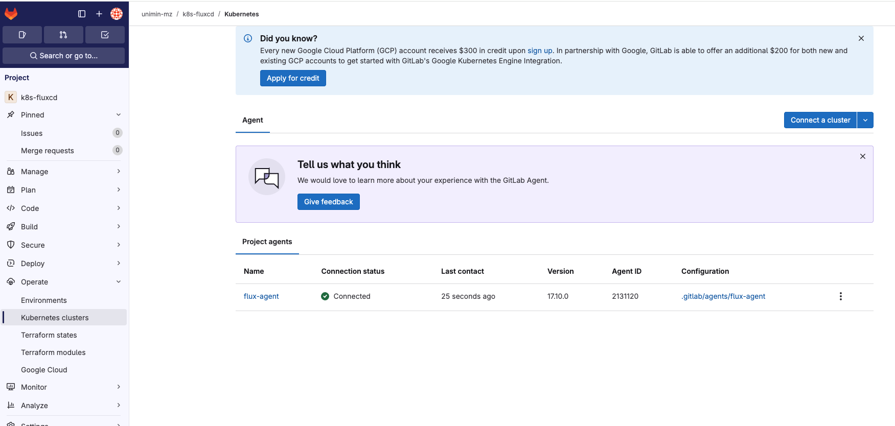
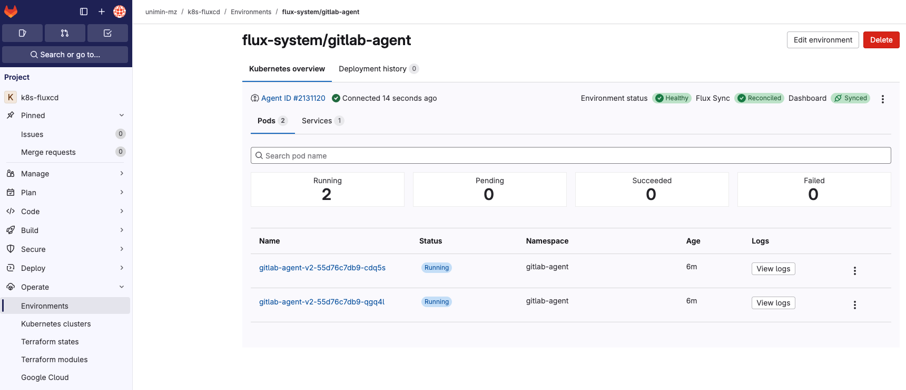
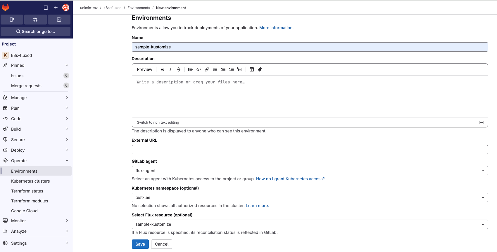
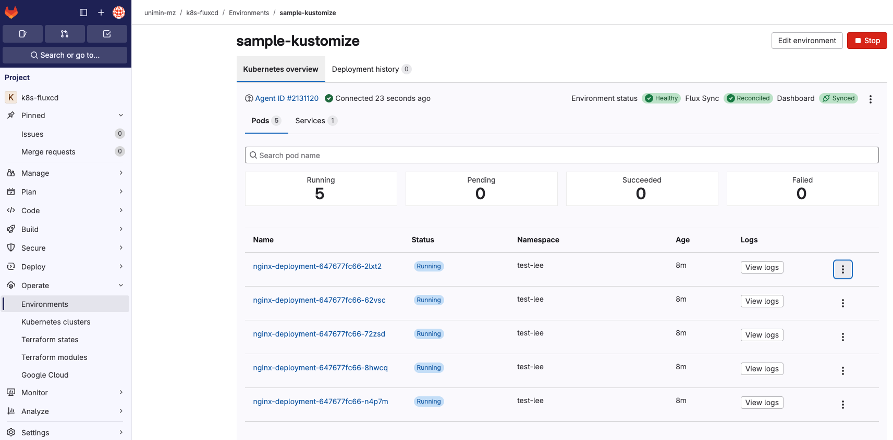

# flux-cli (Bootstrap)、KASあり
## 1.1. Install
### 1.1.1. Bootstrap実行用のPTAを追加する。
flux-cli-kas.mdと同様である。

### 1.1.2. fluxcd管理用 Projectを作成する。
flux-cli-kas.mdと同様である。

### 1.1.3. Bootstrap実行
flux-cli-kas.mdと同様である。

### 1.1.3. KASインストール
- KASとはkubernetes用のGitlab Agentである。
- Gitlab Agnetをインストールするディレクトリを作成する。
```
% mkdir clusters/uni-dev/gitlab-agent
% touch clusters/uni-dev/gitlab-agent/.dummy
% git add clusters/uni-dev/gitlab-agent
% git commit -m "add gitlab-agent"
% git push
warning: redirecting to https://gitlab.com/unimin/k8s-fluxcd.git/
Enumerating objects: 9, done.
Counting objects: 100% (9/9), done.
Delta compression using up to 11 threads
Compressing objects: 100% (3/3), done.
Writing objects: 100% (6/6), 448 bytes | 448.00 KiB/s, done.
Total 6 (delta 0), reused 0 (delta 0), pack-reused 0
To https://gitlab.com/unimin/k8s-fluxcd
   ea0b4ff..7d4fc04  main -> main
% tree
.
├── README.md
└── clusters
    └── uni-dev
        ├── flux-system
        │   ├── gotk-components.yaml
        │   ├── gotk-sync.yaml
        │   └── kustomization.yaml
        ├── gitlab-agent

% pwd
/Users/systemi/Work/gitlab/k8s-fluxcd

% glab cluster agent bootstrap --manifest-path clusters/uni-dev/gitlab-agent flux-agent
Registering Agent ... [OK]
Configuring Agent ... [OK]
Configuring Environment with Dashboard for Agent ... [OK]
Creating Agent Token ... [OK]
Creating Kubernetes Secret with Agent Token ... [OK]
Creating Flux Helm Resources ... [OK]
Syncing Flux Helm Resources ... [OK]
Reconciling Flux Helm Resources ... Output from flux command:
► annotating GitRepository flux-system in flux-system namespace
✔ GitRepository annotated
◎ waiting for GitRepository reconciliation
✔ fetched revision main@sha1:408dea711b4ce65480501cf931b5359c9a64cdf3
► annotating HelmRepository gitlab in flux-system namespace
✔ HelmRepository annotated
◎ waiting for HelmRepository reconciliation
✔ fetched revision sha256:af09d73593fcfea69ef140cd11c5c10bfe9de89ea1a8595e5ea3d7809ef30f99
► annotating HelmChart flux-system-gitlab-agent in flux-system namespace
✔ HelmChart annotated
◎ waiting for HelmChart reconciliation
✔ fetched revision 2.13.0
► annotating HelmRelease gitlab-agent in flux-system namespace
✔ HelmRelease annotated
◎ waiting for HelmRelease reconciliation
✔ applied revision 2.13.0
Successfully bootstrapped the GitLab Agent
```

manifest-pathで指定するpathはlocal経路を指定する必要がある。

```
$ kubectl get ns
NAME              STATUS   AGE
default           Active   5h4m
flux-system       Active   4h51m
gitlab-agent      Active   4m6s
kube-flannel      Active   5h4m
kube-node-lease   Active   5h4m
kube-public       Active   5h4m
kube-system       Active   5h4m

$ kubectl get pod -n gitlab-agent
NAME                               READY   STATUS    RESTARTS   AGE
gitlab-agent-v2-55d76c7db9-jj6gk   1/1     Running   0          3m39s
gitlab-agent-v2-55d76c7db9-vd8w5   1/1     Running   0          3m39s
```

installすると、gitlab-agentのagentが起動される。</br>
gitlabの`Operate -> Kubernetes clusters`にインストールしたKASが見れる。</br>
gitlabの`Operate -> Enviromnets`はAgentによってdeployされたリソースが見れるどころ</br>




```
% flux get all -A       
NAMESPACE       NAME                            REVISION                SUSPENDED       READY   MESSAGE                                           
flux-system     gitrepository/flux-system       main@sha1:408dea71      False           True    stored artifact for revision 'main@sha1:408dea71'

NAMESPACE       NAME                    REVISION        SUSPENDED       READY   MESSAGE                                     
flux-system     helmrepository/gitlab   sha256:af09d735 False           True    stored artifact: revision 'sha256:af09d735'

NAMESPACE       NAME                                    REVISION        SUSPENDED       READY   MESSAGE                                           
flux-system     helmchart/flux-system-gitlab-agent      2.13.0          False           True    pulled 'gitlab-agent' chart with version '2.13.0'

NAMESPACE       NAME                            REVISION        SUSPENDED       READY   MESSAGE                                                                                        
flux-system     helmrelease/gitlab-agent        2.13.0          False           True    Helm install succeeded for release gitlab-agent/gitlab-agent.v1 with chart gitlab-agent@2.13.0

NAMESPACE       NAME                            REVISION                SUSPENDED       READY   MESSAGE                              
flux-system     kustomization/flux-system       main@sha1:408dea71      False           True    Applied revision: main@sha1:408dea71

NAMESPACE       NAME                            SUSPENDED       READY   MESSAGE                                                                                               
flux-system     receiver/gitlab-flux-system     False           True    Receiver initialized for path: /hook/4e569ad1ba8c4ff67809790a78e74e7f5814b881e9c4850817037a5f692f32fd

```
flux-system namespaceに gitlabのhelmrepoとhelmreleaseが作られている。

```
% git pull
warning: redirecting to https://gitlab.com/unimin/k8s-fluxcd.git/
remote: Enumerating objects: 22, done.
remote: Counting objects: 100% (22/22), done.
remote: Compressing objects: 100% (13/13), done.
remote: Total 18 (delta 3), reused 3 (delta 0), pack-reused 0 (from 0)
Unpacking objects: 100% (18/18), 1.81 KiB | 132.00 KiB/s, done.
From https://gitlab.com/unimin/k8s-fluxcd
   7d4fc04..408dea7  main       -> origin/main
Updating 7d4fc04..408dea7
Fast-forward
 .gitlab/agents/flux-agent/config.yaml                        |  5 +++++
 clusters/uni-dev/gitlab-agent/gitlab-agent-helm-release.yaml | 24 ++++++++++++++++++++++++
 clusters/uni-dev/gitlab-agent/gitlab-helm-repository.yaml    |  9 +++++++++
 3 files changed, 38 insertions(+)
 create mode 100644 .gitlab/agents/flux-agent/config.yaml
 create mode 100644 clusters/uni-dev/gitlab-agent/gitlab-agent-helm-release.yaml
 create mode 100644 clusters/uni-dev/gitlab-agent/gitlab-helm-repository.yaml
```
上記のリソースが新規で作られている。

### 1.1.4. KAS Access制限
```
% cat .gitlab/agents/flux-agent/config.yaml 
user_access:
    access_as:
        agent: {}
    projects:
        - id: unimin/k8s-fluxcd
```
このファイルでGitlabのDashboardへのアクセス制限をかけることができる。</br>
詳細は以下に記載されている。</br>
https://docs.gitlab.com/user/clusters/agent/getting_started/#secure-the-deployment


### 1.2. Deploy
- 公式Docにはgitlabのci/cdを利用した方法のみ記載されている。ここではciは使わない。
- 基本的な動作はKustomizeと一緒なのでHelmは割愛とする。
```
% tree
.
├── flux-system
│   ├── gotk-components.yaml
│   ├── gotk-sync.yaml
│   └── kustomization.yaml
├── gitlab-agent
│   ├── gitlab-agent-helm-release.yaml
│   └── gitlab-helm-repository.yaml
└── test-lee
    ├── kustomization.yaml
    ├── test-lee-git-repository.yaml
    ├── test-lee-kustomization.yaml
    ├── test-lee-namespace.yaml
    └── test-lee-secret.yaml

4 directories, 10 files

% git add test-lee
% git commit -m "add test-lee"             
[main b5a04ce] add test-lee
 5 files changed, 47 insertions(+)
 create mode 100644 clusters/uni-dev/test-lee/kustomization.yaml
 create mode 100644 clusters/uni-dev/test-lee/test-lee-git-repository.yaml
 create mode 100644 clusters/uni-dev/test-lee/test-lee-kustomization.yaml
 create mode 100644 clusters/uni-dev/test-lee/test-lee-namespace.yaml
 create mode 100644 clusters/uni-dev/test-lee/test-lee-secret.yaml

% git push
warning: redirecting to https://gitlab.com/unimin/k8s-fluxcd.git/
Enumerating objects: 13, done.
Counting objects: 100% (13/13), done.
Delta compression using up to 11 threads
Compressing objects: 100% (9/9), done.
Writing objects: 100% (10/10), 1.30 KiB | 1.30 MiB/s, done.
Total 10 (delta 1), reused 0 (delta 0), pack-reused 0
To https://gitlab.com/unimin/k8s-fluxcd
   408dea7..b5a04ce  main -> main
```
GitRepoやkustomizationなどflux関連のリソースをここに入れてgitをpushすると自動的にgitlab agentが検知しk8sにreconcileをやってくれる。

```
$ kubectl get ns
NAME              STATUS   AGE
default           Active   5h44m
flux-system       Active   5h31m
gitlab-agent      Active   19m
kube-flannel      Active   5h44m
kube-node-lease   Active   5h44m
kube-public       Active   5h44m
kube-system       Active   5h44m
test-lee          Active   44s   -> KASにて、追加されたリソース

$ kubectl get pod -n test-lee
NAME                                READY   STATUS    RESTARTS   AGE
nginx-deployment-647677fc66-2lxt2   1/1     Running   0          4m3s
nginx-deployment-647677fc66-62vsc   1/1     Running   0          4m3s
nginx-deployment-647677fc66-72zsd   1/1     Running   0          4m3s
nginx-deployment-647677fc66-8hwcq   1/1     Running   0          4m3s
nginx-deployment-647677fc66-n4p7m   1/1     Running   0          4m3s

% flux get all -n test-lee                                                                                  
NAME                                    REVISION                SUSPENDED       READY   MESSAGE                                           
gitrepository/k8s-sample-kustomize      main@sha1:fbc7ae9c      False           True    stored artifact for revision 'main@sha1:fbc7ae9c'

NAME                            REVISION                SUSPENDED       READY   MESSAGE                              
kustomization/sample-kustomize  main@sha1:fbc7ae9c      False           True    Applied revision: main@sha1:fbc7ae9c

NAME                                    SUSPENDED       READY   MESSAGE                                                                                               
receiver/gitlab-k8s-sample-kustomize    False           True    Receiver initialized for path: /hook/ccc139c05a08681ecaaa3b5c4d3c1ce0c06358871c88ec87dd73c690cf039bb7

```


### 1.3. Deploy後にEnvironmentを追加
- 自動でできるか不明だがとりあえず、手動で追加するとDashboardでApplicationが管理できるようになる。



### 1.4. Reconcile
- KASなしのケースと同じく、Manifestを修正してGitlabにpushすると自動的にreconcileされる。

```
% cat overlays/dev/deployment.yaml
apiVersion: apps/v1
kind: Deployment
metadata:
  name: nginx-deployment
  namespace: test-lee
spec:
  replicas: 1  5->1に変更

% flux diff kustomization sample-kustomize --path ./overlays/dev -n test-lee
✓  Kustomization diffing...
► Namespace/test-lee drifted

metadata.labels.kustomize.toolkit.fluxcd.io/name
  ± value change
    - flux-system
    + sample-kustomize

metadata.labels.kustomize.toolkit.fluxcd.io/namespace
  ± value change
    - flux-system
    + test-lee

► Deployment/test-lee/nginx-deployment drifted

metadata.generation
  ± value change
    - 1
    + 2

spec.replicas
  ± value change
    - 5
    + 1

⚠️ identified at least one change, exiting with non-zero exit code

% git add overlays/dev/deployment.yaml
% git commit -m "test-lee replica 5 -> 1"
[main e8ebb17] test-lee replica 5 -> 1
 1 file changed, 1 insertion(+), 1 deletion(-)
% git push
warning: redirecting to https://gitlab.com/unimin/k8s-sample-kustomize.git/
Enumerating objects: 9, done.
Counting objects: 100% (9/9), done.
Delta compression using up to 11 threads
Compressing objects: 100% (4/4), done.
Writing objects: 100% (5/5), 412 bytes | 412.00 KiB/s, done.
Total 5 (delta 2), reused 0 (delta 0), pack-reused 0
To https://gitlab.com/unimin/k8s-sample-kustomize
   fbc7ae9..e8ebb17  main -> main
```

GitRepoのintervalが5mとなっているため、しばらく待機する。

```
$ kubectl get pod -n test-lee
NAME                                READY   STATUS    RESTARTS   AGE
nginx-deployment-647677fc66-2lxt2   1/1     Running   0          15m
```
reconcileされている。